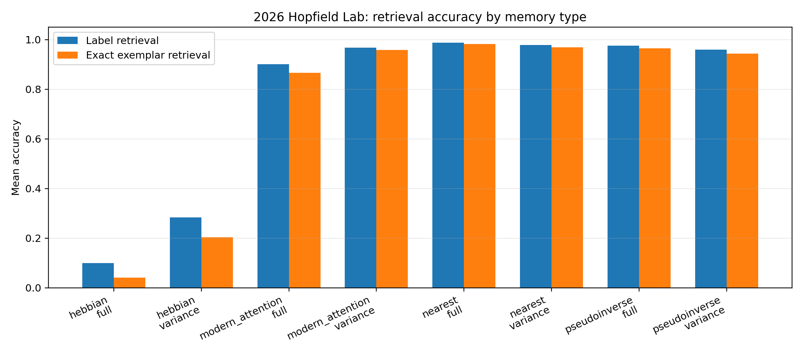
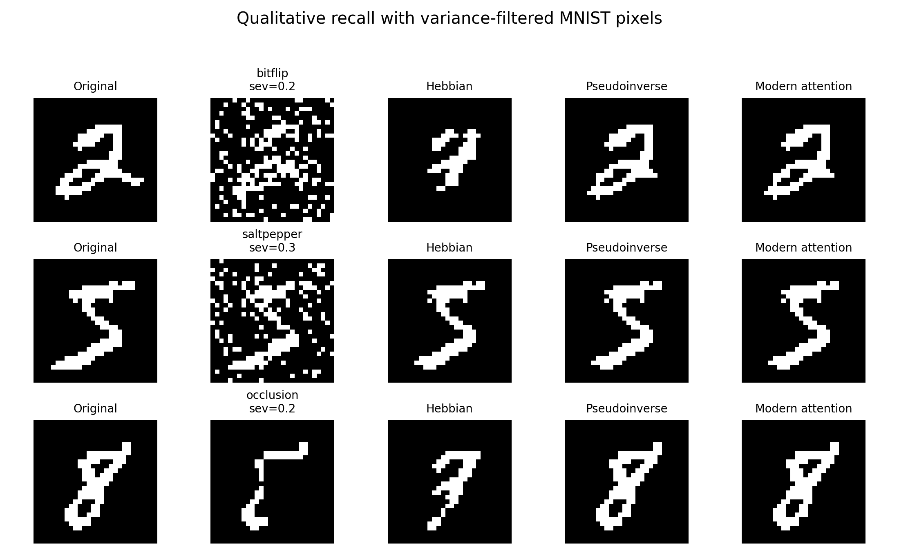
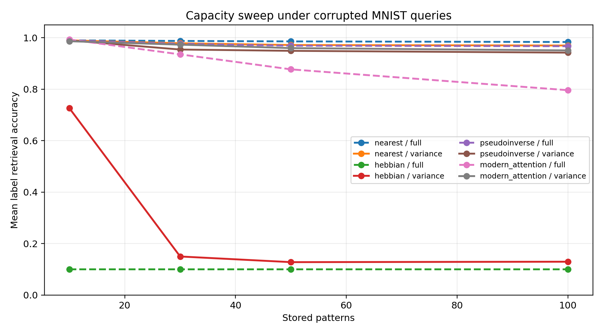
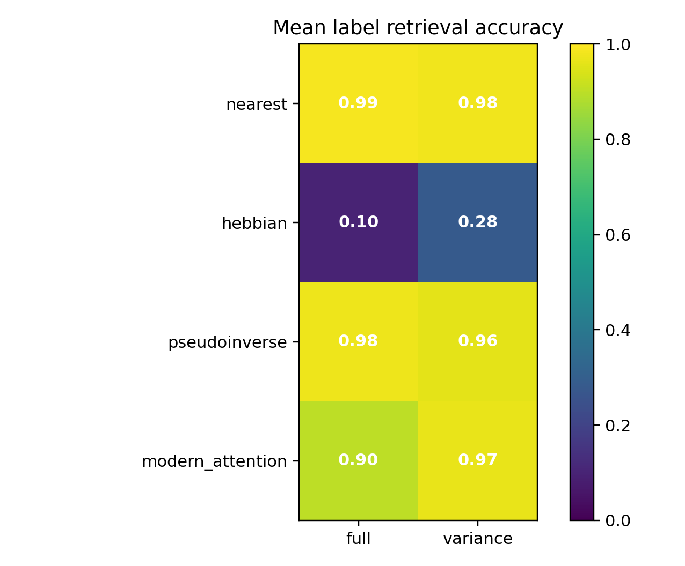

# Hopfield 2026 MNIST

A reproducible computer-vision project comparing **classical Hopfield networks**, **pseudoinverse associative memory**, **modern Hopfield / attention-style retrieval**, and **nearest-neighbor memory** on corrupted MNIST patterns.

This project started as a MATLAB Hopfield-network assignment and was rebuilt into a Python experiment suite with real MNIST IDX data, corruption benchmarks, capacity sweeps, baselines, reports, and figures.

## Main Result

The experiment stores MNIST examples, corrupts them with bit-flip noise, salt-pepper noise, and occlusion, then asks each memory method to retrieve the original stored pattern.

| Method | Pixel mode | Label retrieval | Exact retrieval | Pixel accuracy |
| --- | --- | ---: | ---: | ---: |
| nearest neighbor | full | 0.9869 | 0.9820 | 0.9979 |
| pseudoinverse memory | full | 0.9758 | 0.9655 | 0.9953 |
| modern attention memory | variance-filtered | 0.9677 | 0.9583 | 0.9874 |
| classical Hebbian Hopfield | full | 0.1000 | 0.0408 | 0.8797 |

The key finding is simple and honest:

> Classical Hebbian Hopfield recall fails badly on sparse MNIST images, while pseudoinverse memory and modern attention-style associative retrieval recover corrupted memories reliably. Nearest neighbor remains a very strong baseline and is reported directly.



## Visual Results







## What Is Implemented

- MNIST IDX loading from raw binary files
- Binarized bipolar image patterns
- Corruption models:
  - bit-flip noise
  - salt-pepper noise
  - square occlusion
- Memory/retrieval methods:
  - classical Hebbian Hopfield recall
  - pseudoinverse associative memory
  - modern Hopfield / softmax-attention retrieval
  - nearest-neighbor baseline
- Full-pixel and variance-filtered pixel representations
- Capacity sweep over 10, 30, 50, and 100 stored patterns
- CSV outputs, Markdown reports, and publication-style figures

## Reproduce The Main Experiment

Use Python 3.11.

```powershell
py -3.11 -m pip install -e ".[dev]"
py -3.11 scripts\run_hopfield_2026_lab.py --output-dir artifacts\hopfield_2026_trials10 --trials-per-setting 10
```

The script expects the original MNIST IDX files in:

```text
C:\Users\m.keivanimehr\OneDrive - University of Florida\Desktop\CV Project\Level 1
```

You can pass another MNIST directory:

```powershell
py -3.11 scripts\run_hopfield_2026_lab.py --mnist-dir path\to\mnist_idx_files --output-dir artifacts\hopfield_2026_trials10 --trials-per-setting 10
```

Required files:

```text
train-images.idx3-ubyte
train-labels.idx1-ubyte
```

## Reports

- [Hopfield 2026 Results](reports/hopfield_2026_results.md)
- [Original Hopfield MNIST Reproduction](reports/hopfield_mnist_results.md)

The main report includes the result table, confidence intervals, figures, and interpretation.

## Project Structure

```text
scripts/run_hopfield_2026_lab.py    Main 2026 benchmark
scripts/run_hopfield_mnist.py       Smaller original-project reproduction
reports/                            Markdown result reports
docs/assets/hopfield_2026/          GitHub-visible result figures
artifacts/                          Generated local outputs, ignored by git
```

Some earlier research scaffold files remain in the repository history, but the public-facing project is the Hopfield MNIST lab.

## Validation

The data path and benchmark artifacts were audited:

```text
MNIST image IDX magic: 2051
MNIST label IDX magic: 2049
Training images: 60000
Image shape: 28x28
Benchmark rows: 96 / 96 expected
Metric range violations: 0
Summary recomputation error: 0
```

Tests:

```powershell
py -3.11 -m pytest
```

Latest local result:

```text
5 passed
```

## Scope

This is an associative-memory project, not a new state-of-the-art image classifier.

It is designed to show:

- classical computer-vision experimentation
- raw dataset handling
- memory-based pattern retrieval
- baseline comparison
- reproducible experiment design
- clear visual reporting

## References

- Hopfield, J. J. "Neural networks and physical systems with emergent collective computational abilities." 1982.
- Krotov and Hopfield. "Dense Associative Memory for Pattern Recognition." NeurIPS 2016.
- Ramsauer et al. "Hopfield Networks is All You Need." 2020.
